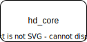

# hardener
Linux加固程序

```text
django==4.2.8
pytest==7.4.3
```

# 使最小化安装的系统符合加固要求

```shell
# run this command as root
echo "hd_admin ALL=(ALL) NOPASSWD:ALL" > /etc/sudoers.d/hd_admin
mv /etc/yum.repos.d /etc/yum.repos.d.backup
curl -o /etc/yum.repos.d/CentOS-Base.repo http://mirrors.cloud.tencent.com/repo/centos8_base.repo
yum install -y https://mirrors.aliyun.com/epel/epel-release-latest-8.noarch.rpm
sed -i 's|^#baseurl=https://download.example/pub|baseurl=https://mirrors.aliyun.com|' /etc/yum.repos.d/epel*
sed -i 's|^metalink|#metalink|' /etc/yum.repos.d/epel*
yum clean all
yum makecache

```

# 特殊目录说明

- `dev_scripts`：为方便开发，编写的命令简化脚本，现用现改
- `readme_statics`：存放 `README.md` 中图片

# 架构



# 吐槽

- `yum` 源用的腾讯源，`epel` 源用的阿里源

# 版本更新表

## version 0.1.2

- [ ] : hd_core 能够远程执行 `echo_hello.sh` 脚本

## version 0.1.1

- [ ] : hd_core 能够导出加固项列表
